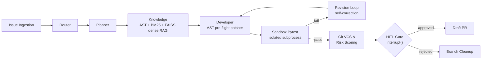

# Autonomous AI Software Engineer (LangGraph + HITL)

Deterministic, stateful multi-agent pipeline with AST pre-flight checks, isolated pytest execution proofs, and Human-in-the-Loop governance.


[](LICENSE)

## Why this exists

Most "AI coding agent" demos stop at generation: a model produces a diff and the demo ends there. Nothing verifies the diff runs, nothing scores its risk, and nothing stops it from being applied. That gap — generation without verification or governance — is where these systems fail in practice, not at the code-generation step itself.

This project treats generation as the easy 20%. The other 80% is: does the fix actually pass the project's own tests in isolation, is the change risky enough to need a second look, and does a human get to see the diff before anything leaves the local machine.

| | Generic LLM Wrapper | Agentic AI Software Engineer |
|---|---|---|
| **Execution state** | Stateless — one prompt, one completion | Durable LangGraph state machine; a paused run persists across a checkpointer and resumes exactly where it stopped |
| **Verification** | None — the model's claim is the only evidence | Real sandboxed `pytest` execution in an isolated subprocess; pass/fail is measured, not asserted |
| **Self-correction** | None — a bad output is the final output | Failing tests route to a revision loop: re-diagnose → re-patch → re-test, up to a bounded retry count |
| **Delivery** | Text in a chat window | Real git branch, real commit, real GitHub Draft PR with a structured, evidence-backed body |
| **Governance** | None | Heuristic risk scoring + a mandatory Human-in-the-Loop gate before any external action |

## Core architecture & pipeline



Every node is a typed function over a single `AgentState` object; the graph is compiled once with a checkpointer, so `interrupt()` at the HITL gate is a genuine pause — not a poll loop — and resumes via `Command(resume=...)` against the same thread.

## Safety & governance deep-dive

- **AST pre-flight validation** — every proposed patch is parsed into a syntax tree and validated *before* it is written to disk. A syntactically broken patch is rejected at that step, never committed.
- **Sandbox isolation** — the QA stage runs tests via `subprocess.run(..., shell=False)` against a command/flag allowlist (`pytest`, `python -m pytest`, `ruff`, `flake8` only), with the workspace's own virtualenv `Scripts`/`bin` prepended to `PATH`. No arbitrary shell execution.
- **Risk assessment heuristics** — after a fix passes tests, the diff is scored `LOW` / `MEDIUM` / `HIGH` based on file sensitivity (`.env`, migrations, CI config, lockfiles), deletion ratio, and number of files touched. High-risk changes get flagged, not silently approved.
- **No-op guard** — if the developer agent finds nothing to change, or patch validation fails, the pipeline aborts before any push or PR is created. No misleading "fix" PR with an empty diff.
- **HITL gate & control panel** — `POST /api/v1/runs` dispatches a run asynchronously (`202 Accepted` via `BackgroundTasks`) and returns immediately; a single-page control panel served at `/dashboard/` polls run status, renders the diff/risk/test proof at the approval gate, and submits the reviewer's decision back to `/api/v1/runs/{id}/resume`.

## Verified proof of work

A live run was executed end-to-end against a public repository, not a mocked fixture:

- **Issue:** [king-man1905/sandbox-ai-demo#3](https://github.com/king-man1905/sandbox-ai-demo/issues/3) — a genuinely failing test (`ZeroDivisionError`) on `main`, confirmed before the run.
- **Result:** [Draft PR #4](https://github.com/king-man1905/sandbox-ai-demo/pull/4) — a real, verified 2-line fix, risk-scored `LOW`, sandbox pytest `2 passed / 0 failed`.
- **Test suite:** **165 unit tests passing, 0 failures** (`pytest -v --tb=short`), covering routing, patching, sandboxing, VCS operations, revision/self-correction, telemetry, and the API layer.

Token/cost telemetry is captured where the provider reports it, and renders `N/A` — not a misleading `$0.0000` — when it doesn't (a real, documented limitation of some LLM providers' structured-output path, not a bug being hidden).

## Quickstart

**Prerequisites:** Python 3.11+, Git.

```bash
git clone https://github.com/king-man1905/agentic-ai-software-engineer.git
cd agentic-ai-software-engineer

python -m venv .venv
.venv\Scripts\activate        # Windows
# source .venv/bin/activate   # macOS/Linux

pip install -r requirements.txt
cp .env.example .env          # set NVIDIA_API_KEY (or GOOGLE_API_KEY + LLM_PROVIDER=gemini) and GITHUB_TOKEN
```

Run the test suite:

```bash
pytest -v --tb=short          # 165 passed
```

Launch the API and dashboard:

```bash
uvicorn backend.api.app:app --reload
# open http://127.0.0.1:8000/dashboard/
```

### Control Plane Local Development

The React control plane (`frontend/`) is a separate dev server from the FastAPI backend; run both side by side in two terminals:

```bash
# Terminal 1 - backend, from the project's .venv (see Quickstart above)
uvicorn backend.api.app:app --reload

# Terminal 2 - frontend, from the frontend directory
cd frontend
npm install
npm run dev
```

- Backend: http://127.0.0.1:8000
- Frontend: http://localhost:5173 (proxies `/api` and `/health` to the backend)

Resolve a real GitHub issue from the CLI:

```bash
python -m backend.integrations.run_github_bot --repo <owner>/<repo> --issue <N>
# pauses for human approval by default; add --auto-approve for unattended runs
```

## Production roadmap & architectural limits

Honest disclosure — this runs correctly today at the scale of one operator working one repo at a time. Running it as a shared service needs the following, none of which are done yet:

| Current | Production requirement |
|---|---|
| `MemorySaver` — in-process, RAM-only checkpointer | PostgreSQL/Redis-backed checkpointer, so a paused approval survives a restart and works across multiple API instances |
| Subprocess allowlist for sandboxing | Containerized isolation (Docker / gVisor / Firecracker) — an allowlisted command can still execute arbitrary code the agent itself wrote |
| `BackgroundTasks` (in-process) | Celery/RQ + Redis (or a durable workflow engine) for distributed workers, retries, and rate limiting independent of the API process |
| 2-second dashboard polling | WebSockets/SSE for real-time node-by-node progress and log streaming |
| Single-file, exact-snippet patching | Unified-diff/`git apply`-based, transactional multi-file patch sets |
| Manual CLI trigger against a static PAT | A GitHub App with signature-verified webhooks and installation-scoped tokens |
| No API authentication, open CORS (`*`) | API keys/OAuth, per-tenant workspace isolation, rate limiting |
| Two overlapping FastAPI entrypoints (`main.py`, `api/app.py`) | One entrypoint |
| `.env` file secrets | A secrets manager (Vault / AWS Secrets Manager / equivalent) |

## License

This project is licensed under the [MIT License](LICENSE) &copy; 2026 king-man1905.

