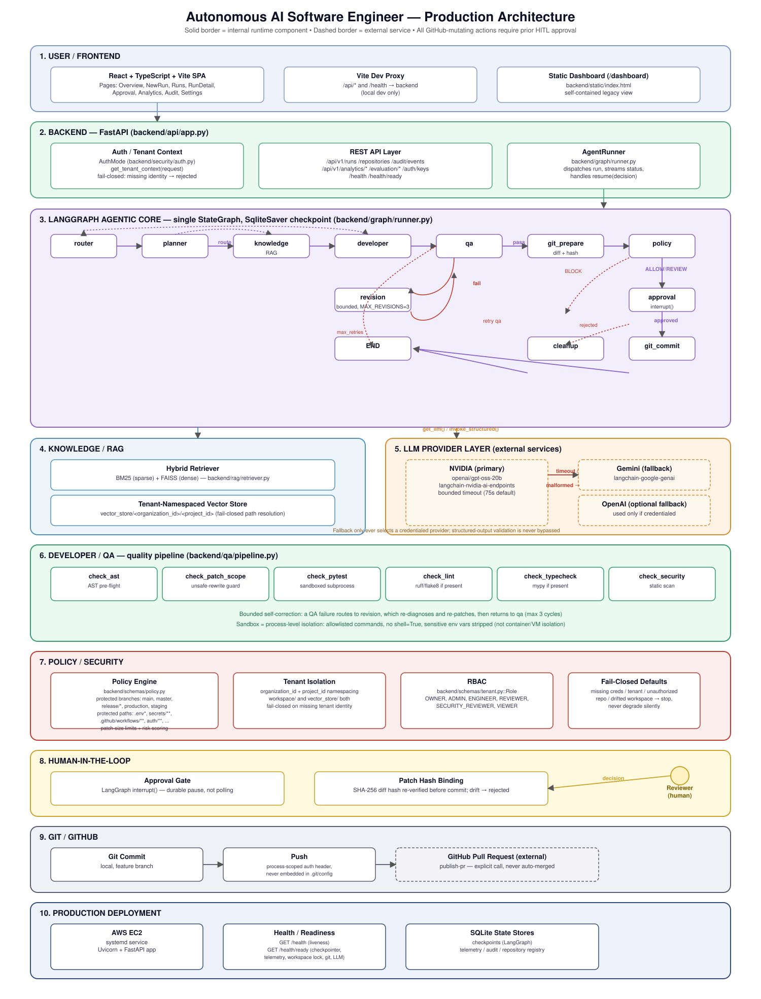
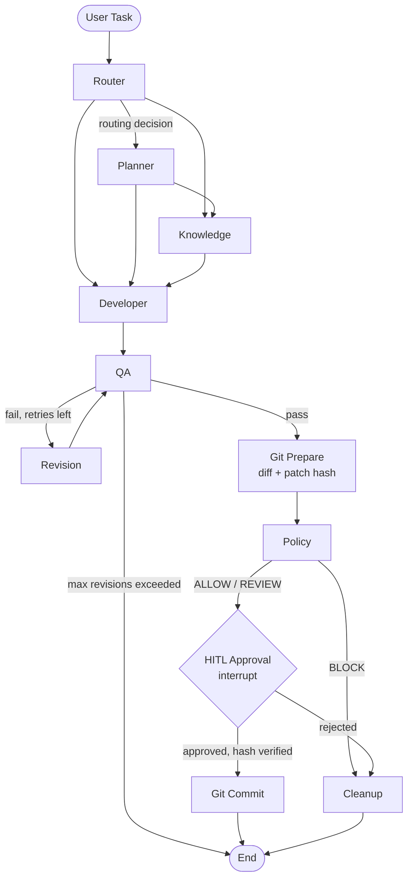

# Autonomous AI Software Engineer

An agentic software-engineering control plane: given a natural-language task and a target repository, it plans the work, retrieves relevant repository context, generates a code change, verifies it in an isolated sandbox, evaluates it against organizational policy, pauses for human approval, and — only after that approval — commits, pushes, and opens a GitHub Pull Request.


[](LICENSE)

This is not "generate a diff and stop." The pipeline is a durable, resumable state machine: every run persists to a SQLite-backed checkpointer, so a run paused at the human-approval gate survives a server restart and resumes exactly where it left off. Nothing reaches GitHub without an explicit, hash-bound human decision.

## Key Capabilities

- **Task understanding & routing** — classifies the incoming request (bug fix, documentation, code generation, review, knowledge search, etc.) and decides whether planning or repository knowledge is actually needed.
- **Planning** — produces an execution plan for tasks that require multiple engineering steps.
- **Repository-aware knowledge retrieval (RAG)** — hybrid BM25 (sparse) + FAISS (dense, tenant-namespaced vector store) retrieval with retrieval-quality evaluation and bounded query rewriting.
- **Code generation** — AST-aware patch generation against the real repository context.
- **Quality assurance** — AST pre-flight validation, isolated sandbox test execution, static security scanning, and patch-scope safety checks before anything is trusted.
- **Self-correction (revision loop)** — a failing QA result routes back through a bounded revision cycle (re-diagnose → re-patch → re-evaluate) rather than giving up or silently shipping a broken change.
- **Policy evaluation** — deterministic organizational policy checks (protected branches/paths, patch size limits, risk scoring) before any human is even asked to look at the diff.
- **Human-in-the-loop approval** — a genuine `interrupt()`-based pause; nothing is committed until a reviewer explicitly approves the *exact* diff, bound by cryptographic hash.
- **Git commit & push** — only after approval, and only if the workspace hasn't drifted from what was approved.
- **GitHub Pull Request creation** — a real PR against the target repository, publishable only after a committed, approved run.

## Architecture

The pipeline is a single [LangGraph](https://langchain-ai.github.io/langgraph/) `StateGraph` over one typed `AgentState`, compiled once with a durable SQLite checkpointer. Every node below exists in `backend/graph/runner.py` / `backend/graph/nodes.py` — this diagram is not aspirational.

Full-system diagram (frontend, backend, LangGraph core, RAG, LLM provider layer, QA, policy/security, HITL, Git/GitHub, production deployment):





`Router → Planner → Knowledge/RAG → Developer → QA → (Revision loop, bounded) → Git Prepare → Policy → HITL Approval → Git Commit → GitHub PR` is the intended path for a real code change; planning and knowledge retrieval are conditionally skipped when the router determines they aren't needed. A GitHub Pull Request is published via a separate, explicit `publish-pr` call after a run reaches `COMPLETED` with a committed, approved change — it is never created automatically.

## LLM Provider Architecture

- **Primary provider: NVIDIA** (`openai/gpt-oss-20b`, via NVIDIA's hosted OpenAI-compatible endpoint), with a bounded request timeout (75s by default, configurable).
- **Automatic, credential-aware fallback** to Gemini (or OpenAI) when the primary provider times out or returns a transient/malformed response. Fallback provider selection only ever considers a provider whose API key is actually present — an uncredentialed provider is never selected, not even as a last resort.
- **Structured-output validation is never bypassed by fallback.** Every provider, primary or fallback, must return a schema-validated Pydantic object (e.g. `RoutingDecision`); a malformed response is classified and retried, not silently accepted.
- **Timeout and malformed-response classification** are explicit, typed exception categories (`LLMTimeoutError`, `LLMMalformedResponseError`, etc.), each independently eligible or ineligible for fallback — an authentication or invalid-request error, for example, is never retried through a fallback provider.
- **Verified in production:** a live run demonstrated the exact failure/recovery path — NVIDIA's primary request timed out at the configured bound, the run automatically fell back to Gemini, and the pipeline continued to a validated `RoutingDecision` and, ultimately, a completed run. This was NVIDIA timing out and Gemini recovering it — not NVIDIA succeeding directly.
- Fallback configuration is **optional and visible, never silent**: `GET /health/ready` reports the current primary provider, whether it's credentialed, and whether a fallback provider is configured, so a deployment running without a fallback credential is never mistaken for one that has a safety net.

## QA and Safety

| Control | What it actually does |
|---|---|
| **AST pre-flight validation** | Every proposed patch is parsed into a syntax tree and rejected before being written to disk if it isn't valid Python. |
| **Sandboxed test execution** | Tests run via `subprocess.run(..., shell=False)` against a strict command/flag allowlist (`pytest`, `python -m pytest`, `ruff`, `flake8`), with sensitive environment variables stripped from the child process. This is **process-level isolation**, not a container or VM boundary — it prevents arbitrary shell invocation and secret exposure to the executed code, but does not claim OS-level sandboxing. |
| **Static security scan** | A dedicated QA check flags unsafe patterns before a patch is trusted. |
| **Patch-scope guard** | Detects and rejects unsafe additive/destructive rewrites and hallucinated patch-wrapper artifacts before they ever reach disk. |
| **Bounded revision loop** | A failing QA result triggers at most a fixed number of re-diagnose/re-patch/re-test cycles (`MAX_REVISIONS = 3`), never an unbounded retry. |
| **Policy engine** | Deterministic checks: protected branches (`main`, `master`, `release/*`, `production`, `staging`), protected paths (`.env*`, `secrets/**`, `.github/workflows/**`, `auth/**`, `security/**`, `database/migrations/**`), patch size limits, and risk scoring — evaluated before a human is ever asked to approve. |
| **Tenant isolation** | Every workspace, vector store, and repository registration is namespaced by `(organization_id, project_id)`. Missing tenant identity fails closed rather than falling back to a shared/default namespace. |
| **Approval hash binding** | An approval decision is bound to the exact SHA-256 hash of the diff it approved; if the workspace drifts after approval but before commit, the commit is rejected. |
| **HITL approval gate** | A genuine LangGraph `interrupt()` — the run durably pauses, not polls, until a reviewer submits a decision. |
| **Fail-closed defaults** | Missing credentials, missing tenant identity, an unauthorized repository, or a workspace that isn't a genuine, correctly-scoped clone all stop the pipeline rather than guessing or degrading silently. |

## Human-in-the-Loop Workflow

```
Developer proposes a patch
        │
        ▼
   QA (AST, sandbox tests, security scan, patch-scope)
        │  pass
        ▼
   Policy evaluation (ALLOW / REVIEW / BLOCK)
        │  not blocked
        ▼
   Approval gate — run pauses (interrupt), diff + risk + patch hash surfaced
        │  reviewer approves, submitting the exact patch hash
        ▼
   Hash re-verified against the current workspace diff
        │  match
        ▼
   Git commit  →  push  →  GitHub Pull Request (publish-pr, separate explicit call)
```

No external GitHub mutation — commit, push, or PR — is reachable without a human approval decision that is cryptographically bound to the specific diff being approved. A rejected or policy-blocked run is cleaned up (feature branch removed, workspace restored) instead of left half-applied.

## Production Deployment

- **API:** FastAPI, served by Uvicorn (`backend.api.app:app`).
- **Orchestration:** LangGraph `StateGraph`, checkpointed to SQLite (durable across restarts — a paused approval is not lost).
- **Frontend:** a React + TypeScript + Vite single-page control plane (`frontend/`) — Overview, New Run, Runs, Run Detail, Approval, Analytics, Audit, and Settings pages — talking to the API via a typed client with a dev-mode proxy to avoid local CORS/loopback ambiguity. A lightweight, self-contained static dashboard is also served at `/dashboard`.
- **Deployment target:** an AWS EC2 instance running the API as a `systemd` service, with the working repository updated via `git pull --ff-only` and restarted on deploy.
- **Health/readiness:** `GET /health` (liveness) and `GET /health/ready` (granular readiness — checkpointer, telemetry store, workspace lock directory, `git` availability, and LLM provider/fallback configuration).
- **GitHub integration:** repository cloning and push authenticate via a process-scoped HTTP `Authorization` header — never a token embedded in the clone URL or written to `.git/config`.

## Production Validation

The following results are from a completed, real production verification run — not a mocked or simulated test:

| Check | Result |
|---|---|
| Backend test suite | **768 passed, 2 skipped, 0 failed** |
| EC2 deployment | Successful; service active |
| `GET /health` | `healthy` |
| `GET /health/ready` | `ready`, all checks passing |
| LLM fallback configuration | Visible and confirmed configured on the production instance |
| Provider fallback | Real NVIDIA timeout → automatic Gemini fallback → valid structured result, confirmed via production telemetry |
| QA result | `PASS` |
| Policy result | `ALLOW` |
| Human approval | Granted, bound to the exact patch hash |
| Commit | Confirmed committed (verified via telemetry, not status alone) |
| GitHub Pull Request | Created via the standard commit → push → PR pipeline, left open for review (never auto-merged) |
| Credential-leak scan | 0 matches across workspace files, telemetry databases, and `.git/config` |

## Security

- Secrets (`NVIDIA_API_KEY`, `GOOGLE_API_KEY`, `OPENAI_API_KEY`, `GITHUB_TOKEN`) are read from environment variables only — `.env` is git-ignored and has never been committed.
- GitHub tokens are never embedded in a clone/remote URL, never written to `.git/config`, and never passed into the sandboxed test-execution environment or an LLM prompt.
- Telemetry, audit logs, and readiness diagnostics are checked to ensure they never contain credential values — verified with dedicated tests and repeated production credential-leak scans (0 matches).
- Role-Based Access Control: `OWNER`, `ADMIN`, `ENGINEER`, `REVIEWER`, `SECURITY_REVIEWER`, `VIEWER`, enforced per organization.
- Tamper-evident, hash-chained audit logging for tenant-sensitive actions.
- Production `AUTH_MODE` fails closed: a missing authenticated identity is rejected, never silently defaulted to a real tenant.

No credential value, token, or key appears anywhere in this repository, its documentation, or its logs.

## Tech Stack

**Backend:** Python 3.11+, FastAPI, Uvicorn, LangGraph (`langgraph`, `langgraph-checkpoint-sqlite`), LangChain (`langchain`, `langchain-community`, `langchain-text-splitters`, `langchain-nvidia-ai-endpoints`, `langchain-google-genai`, `langchain-openai`), FAISS (`faiss-cpu`), Pydantic, `python-dotenv`, `pytest`.

**Frontend:** React 18, TypeScript, Vite, Vitest + Testing Library.

**Infrastructure:** AWS EC2, `systemd`, SQLite (checkpoints, telemetry, repository registry, idempotency store).

## Project Structure

```
backend/
├── agents/          # router, knowledge/QA agent logic
├── api/              # FastAPI app, routes, lifecycle/readiness
├── core/              # configuration loading
├── developer/         # patch generation and safe application
├── graph/              # LangGraph nodes, edges, AgentState, runner
├── indexer/             # repository scanning, AST chunking
├── integrations/         # GitHub client, CLI runner
├── observability/         # telemetry, analytics, evaluation
├── policy/                 # policy engine, path filtering
├── qa/                      # quality pipeline (AST/sandbox/security/lint)
├── rag/                      # embeddings, retriever, vector-store paths
├── revision/                   # self-correction / revision loop
├── sandbox/                     # isolated test-execution runner
├── schemas/                      # Pydantic models (routing, QA, policy, tenant...)
├── security/                      # tenant manager, RBAC, audit, auth
├── services/                       # LLM provider construction
├── static/                          # built-in dashboard (served at /dashboard)
└── vcs/                              # git operations, workspace paths, locks

frontend/
└── src/
    ├── api/        # typed API client (runs, repositories, auth, analytics, audit)
    ├── components/  # HITL, runs, layout, common UI
    ├── hooks/        # auth, run polling, analytics
    ├── pages/         # Overview, NewRun, Runs, RunDetail, Approval, Analytics, Audit, Settings
    └── types/          # API/telemetry/policy/QA/tenant type definitions

tests/    # backend regression suite (pytest)
```

## Local Setup

**Prerequisites:** Python 3.11+, Node.js, Git.

```bash
git clone <this repository>
cd "Agentic AI Software Engineer"

python -m venv .venv
.venv\Scripts\activate        # Windows
# source .venv/bin/activate   # macOS/Linux

pip install -r requirements.txt
cp .env.example .env
```

Edit `.env` and set at minimum `NVIDIA_API_KEY` (the primary provider). `GOOGLE_API_KEY`/`OPENAI_API_KEY` are optional but enable automatic fallback — see `.env.example` for the full, documented list of variables. **Never put a real credential in this README or commit `.env`.**

```bash
pytest tests/ -q
uvicorn backend.api.app:app --reload
```

Frontend (separate terminal):

```bash
cd frontend
npm install
npm run dev
```

- Backend: `http://127.0.0.1:8000`
- Frontend: `http://localhost:5173` (proxies `/api` and `/health` to the backend in dev mode)

## API / Health Endpoints

| Method | Path | Purpose |
|---|---|---|
| GET | `/health` | Liveness probe |
| GET | `/health/ready` | Readiness — checkpointer, telemetry store, workspace lock, `git`, LLM provider/fallback configuration |
| GET | `/api/v1/tenant/context` | Authenticated tenant/role context |
| POST | `/api/v1/repositories` | Register and authorize a repository for the caller's organization |
| POST | `/api/v1/runs` | Create and dispatch a new engineering run |
| GET | `/api/v1/runs` | List runs for the caller's organization |
| GET | `/api/v1/runs/{run_id}` | Get current run status |
| GET | `/api/v1/runs/{run_id}/events` | Chronological telemetry events for a run |
| POST | `/api/v1/runs/{run_id}/resume` | Submit a HITL approval/rejection decision |
| POST | `/api/v1/runs/{run_id}/cancel` | Request cancellation of a run |
| POST | `/api/v1/runs/{run_id}/publish-pr` | Publish an approved, committed run as a GitHub PR |
| GET | `/api/v1/audit/events` | Tamper-evident audit log |
| POST/DELETE | `/api/v1/auth/keys...` | API key lifecycle |
| GET | `/api/v1/analytics/*` | Run, quality, model, and failure analytics |
| POST/GET | `/api/v1/evaluation/*` | Deterministic benchmark evaluation |

## Example Workflow

1. A caller registers `owner/repo` and submits a task: *"Add an 'E2E Test' section to README.md explaining the pipeline."*
2. **Router** classifies it as documentation, requiring no planning or extra knowledge.
3. **Developer** generates a patch adding the requested section, using the actual current content of `README.md` as context.
4. **QA** parses the patch (AST), runs the repository's own test suite in the sandbox, scans for unsafe patterns, and confirms the patch is scoped safely.
5. **Policy** evaluates the diff — a documentation change to a non-protected path passes cleanly.
6. The run pauses at **Approval**, surfacing the diff, risk assessment, and a SHA-256 patch hash.
7. A reviewer approves, submitting that exact hash.
8. The workspace is re-verified against the hash, then **committed** on a fresh feature branch and **pushed**.
9. The run's owner calls **publish-pr**, which opens a real GitHub Pull Request against the target repository — left open for human review, never auto-merged.

## Limitations / Operational Notes

- **External LLM provider latency is real and out of this project's control.** NVIDIA's hosted endpoint for the configured model can legitimately exceed the bounded timeout; this is handled by classification and fallback, not by disguising it.
- **A fallback credential is optional, not guaranteed.** Without `GOOGLE_API_KEY`/`OPENAI_API_KEY` configured, a primary-provider timeout intentionally fails the run closed rather than silently retrying nowhere — this is visible via `GET /health/ready`, never silent.
- **Human approval is mandatory** for any run that would mutate a real repository or open a Pull Request; there is no unattended/auto-approve mode in the production API path.
- **Sandbox isolation is process-level**, not container/VM-level — it enforces a strict command allowlist and strips sensitive environment variables, but is not a substitute for OS-level sandboxing in a fully untrusted multi-tenant context.
- **SQLite-backed persistence** (checkpoints, telemetry, repository registry) is durable across restarts but is single-instance; it is not designed for multi-instance horizontal scaling without further work.

## Roadmap

Sensible, honest future directions — not implemented today:

- Containerized (Docker) sandbox execution for stronger isolation than the current process-level allowlist.
- A distributed, multi-instance-safe checkpoint/queue backend (e.g. PostgreSQL/Redis) for horizontal scaling.
- WebSocket/SSE-based real-time run progress instead of polling.
- A GitHub App (installation tokens, signed webhooks) in place of a single long-lived personal access token.
- A managed secrets store (e.g. a cloud secrets manager) in place of a `.env` file for production deployments.

## License

This project is licensed under the [MIT License](LICENSE).
