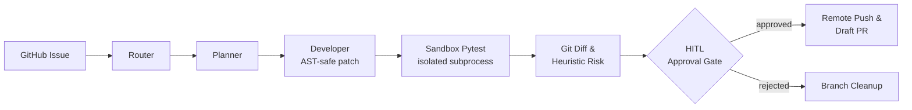

# Autonomous AI Software Engineer

A multi-agent system built on **LangGraph** that takes a GitHub issue, plans and
implements a fix, verifies it in an isolated **pytest sandbox**, computes a
risk-scored diff, pauses for **human approval**, and opens a real GitHub PR —
end to end, with no code written by hand.

## Architecture



Each stage is a LangGraph node with typed state (`AgentState`); the graph is
durable and resumable — an approval gate is a real `interrupt()`, not a
polling loop, so a run can sit paused indefinitely and resume exactly where
it left off.

## Live demonstration

Run live end-to-end against a public repo:
**[king-man1905/sandbox-ai-demo#3](https://github.com/king-man1905/sandbox-ai-demo/issues/3)**
→ **[Draft PR #4](https://github.com/king-man1905/sandbox-ai-demo/pull/4)**

| Check | Result |
| --- | --- |
| Unified diff | Real, verified 2-line fix (`+2 / -0`) — not a description, an actual patch |
| Risk assessment | 🟢 `LOW` — standard code change, no config/high-risk files touched |
| Sandbox pytest | `2 passed`, isolated subprocess, exit code 0 |
| Human approval | Gated (auto-approved for this demo run; off by default — see below) |

## Key engineering safeguards

- **AST pre-flight validation** — every patch is parsed before it's ever written to disk; a syntactically broken patch is rejected, not committed.
- **Command-allowlisted sandbox** — the QA stage only ever runs `pytest`/`ruff`/`flake8` via `subprocess` with `shell=False`; no arbitrary shell execution.
- **No-op guard** — if the developer agent finds nothing to fix (or patch validation fails), the run aborts before touching GitHub. No empty or misleading PRs.
- **Human-in-the-loop by default** — `solve_issue_and_open_pr()` pauses for human approval before any PR is opened; unattended auto-approval is an explicit opt-in (`--auto-approve`), not the default.
- **Collision-hardened branch naming** — every branch gets a random entropy suffix, so two runs never silently clobber each other's PR.
- **Observability layer** — every LLM call's token usage is captured where the provider supports it; when it can't be measured (e.g. some providers don't expose usage during structured-output calls), the PR body says `N/A` — never a misleading `$0.0000`.

## Quickstart

```bash
pip install -r requirements.txt
cp .env.example .env
# set NVIDIA_API_KEY (or GOOGLE_API_KEY + LLM_PROVIDER=gemini) and GITHUB_TOKEN in .env
```

Run the test suite:

```bash
python -m pytest -v --tb=short   # 163 passed
```

Resolve a real GitHub issue and open a PR:

```bash
python -m backend.integrations.run_github_bot --repo <owner>/<repo> --issue <N>
# pauses for approval by default; add --auto-approve to run fully unattended
```

| Flag | Purpose |
| --- | --- |
| `--repo` | Target repository, `owner/repo` |
| `--issue` | Issue number to resolve |
| `--base-branch` | Branch to open the PR against (default `main`) |
| `--project-id` | Local workspace project (defaults to repo name) |
| `--auto-approve` | Skip human review at the HITL gate (off by default) |
| `--token` | GitHub token (defaults to `GITHUB_TOKEN` env var) |
| `--ready-for-review` | Open as a normal PR instead of a draft |
